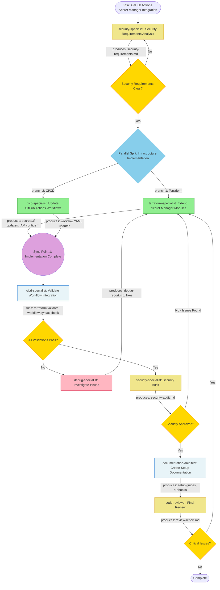

# Task Analysis: GitHub Actions Secret Manager Integration

## Complexity Assessment
**Medium** - This task involves modifying existing Terraform infrastructure and CI/CD workflows to integrate Secret Manager for storing GitHub Actions environment variables. The complexity stems from:
- Multi-architecture pattern updates (event-driven, microservices-gke, workflow-batch)
- Security-critical changes requiring careful IAM configuration
- GitHub Actions workflow modifications with potential for breaking changes
- Integration testing across multiple environments (dev/prod)

The codebase already has a foundational Secret Manager implementation in the event-driven pattern, which reduces complexity. However, proper security validation, cross-pattern consistency, and thorough documentation are essential.

## Recommended Agents

- **security-specialist** (Model: sonnet): Analyze security requirements for Secret Manager integration, validate IAM policies, ensure least-privilege access patterns, and audit the final implementation for security vulnerabilities.

- **terraform-specialist** (Model: sonnet): Extend existing Secret Manager Terraform modules (`secrets.tf`), apply to microservices-gke and workflow-batch patterns, configure IAM bindings for GitHub Actions service accounts, and validate Terraform configurations.

- **cicd-specialist** (Model: sonnet): Modify GitHub Actions workflows to fetch secrets from Secret Manager instead of GitHub Secrets, implement authentication steps using Workload Identity Federation, and ensure proper error handling and fallback mechanisms.

- **documentation-architect** (Model: sonnet): Create comprehensive setup documentation, migration guides from GitHub Secrets to Secret Manager, runbooks for secret rotation, and troubleshooting guides.

- **code-reviewer** (Model: sonnet): Perform final quality review of all changes, validate security best practices, ensure consistency across patterns, and verify documentation completeness.

## Agent Execution Flow

**Mermaid Diagram**: [View flow diagram](./docs/task-flow-github-actions-secret-manager-integration.mmd)

Click to view inline diagram

## Agent Interaction Matrix

| Agent | Phase | Input Dependencies | Tools Used | Output Artifacts | Can Parallelize With |
|-------|-------|-------------------|------------|------------------|---------------------|
| **security-specialist** | 1 | Task description, existing secrets.tf | Read, Grep, Write | `docs/security-requirements.md`, IAM policy recommendations | None (Sequential - must define security requirements first) |
| **terraform-specialist** | 2 | `security-requirements.md`, existing Terraform modules | Read, Write, Edit, Bash (terraform validate) | Updated `secrets.tf` for all patterns, IAM binding configurations | cicd-specialist (different file scopes) |
| **cicd-specialist** | 2 | `security-requirements.md`, GitHub Actions workflows | Read, Write, Edit | Updated workflow YAML files with Secret Manager steps | terraform-specialist (different file scopes) |
| **cicd-specialist** | 3 | Terraform outputs, updated workflows | Bash (terraform validate, yaml linter) | Integration test results | None (Sequential - validates Phase 2 outputs) |
| **debug-specialist** | 3* | Error logs, test failures (conditional) | Read, Grep, Bash, Task | `docs/debug-report.md`, fix implementations | None (Sequential - only if tests fail) |
| **security-specialist** | 4 | All implementation files, IAM configurations | Read, Grep, Write | `docs/security-audit.md`, approval or issues list | None (Sequential - audits Phase 2-3 work) |
| **documentation-architect** | 5 | All implementation files, security audit | Read, Write, Glob | `docs/secret-manager-setup.md`, migration guide, runbooks | None (Sequential - documents completed implementation) |
| **code-reviewer** | 6 | All implementation and documentation files | Read, Grep, Write | `docs/review-report.md`, final approval | None (Sequential - final validation) |

## Detailed Task Breakdown

### Phase 1: Security Requirements Analysis (Sequential - 5-8 minutes)

**Step 1.1** - Agent: `security-specialist`
- **Input**: Task description, existing `architectures/event-driven/gcp/modules/secrets.tf`, GitHub Actions workflows
- **Actions**:
  - Analyze current Secret Manager implementation for security gaps
  - Define IAM least-privilege policies for GitHub Actions service account
  - Specify secret access patterns and scope (which secrets, which workflows)
  - Document encryption requirements and audit logging needs
  - Create security checklist for implementation validation
- **Tools**: Read, Grep, Write
- **Output**: `docs/security-requirements.md` with IAM policies, access patterns, and validation criteria
- **Can Parallel With**: None
- **Estimated Time**: 5-8 minutes
- **Blocking**: Yes - all other agents depend on these requirements

**Synchronization Point 1**: Security requirements must be approved before proceeding to implementation

---

### Phase 2: Infrastructure & CI/CD Implementation (Parallel - 12-18 minutes max)

**Step 2.1** - Agent: `terraform-specialist`
- **Input**: `docs/security-requirements.md`, existing Terraform modules
- **Actions**:
  - Review and enhance existing `architectures/event-driven/gcp/modules/secrets.tf`
  - Copy and adapt Secret Manager module to `microservices-gke` and `workflow-batch` patterns
  - Add IAM bindings for GitHub Actions service account to access secrets
  - Configure secret replication and rotation policies
  - Add outputs for secret resource names and accessor roles
  - Run `terraform fmt`, `terraform validate`, and `tflint` on all changes
- **Tools**: Read, Write, Edit, Bash (terraform commands)
- **Output**:
  - `architectures/microservices-gke/gcp/modules/secrets.tf`
  - `architectures/workflow-batch/gcp/modules/secrets.tf`
  - Updated `architectures/event-driven/gcp/modules/secrets.tf`
  - IAM binding additions in respective `iam.tf` files
  - Updated `outputs.tf` files
- **Can Parallel With**: cicd-specialist (Step 2.2)
- **Estimated Time**: 12-18 minutes
- **Blocking**: Blocks Phase 3 integration testing

**Step 2.2** - Agent: `cicd-specialist`
- **Input**: `docs/security-requirements.md`, existing GitHub Actions workflow files
- **Actions**:
  - Add Secret Manager access step before `terraform init` in all workflows
  - Implement `gcloud secrets versions access` commands to fetch secrets
  - Update workflows to use fetched secret values instead of `${{ secrets.* }}`
  - Add error handling and fallback for secret access failures
  - Update workflow documentation comments
  - Validate YAML syntax for all modified workflows
- **Tools**: Read, Write, Edit, Bash (yaml linter)
- **Output**:
  - Updated `.github/workflows/terraform-apply.yml`
  - Updated `.github/workflows/terraform-ci.yml`
  - Updated `.github/workflows/terraform-apply-with-approval.yml`
  - Updated `.github/workflows/terraform-plan-pr.yml` (if exists)
- **Can Parallel With**: terraform-specialist (Step 2.1)
- **Estimated Time**: 10-15 minutes
- **Blocking**: Blocks Phase 3 integration testing

**Synchronization Point 2**: Both Terraform and CI/CD implementations must complete before integration testing

---

### Phase 3: Integration & Validation (Sequential - 6-10 minutes)

**Step 3.1** - Agent: `cicd-specialist`
- **Input**: All Terraform modules from Step 2.1, all workflow files from Step 2.2
- **Actions**:
  - Run `terraform init -backend=false` and `terraform validate` for all patterns
  - Validate workflow YAML syntax with `actionlint` or `yaml-lint`
  - Verify secret resource names match workflow references
  - Check IAM binding consistency across patterns
  - Create integration test checklist
- **Tools**: Bash (terraform, yaml validators), Read, Grep
- **Output**: Integration validation report, test results
- **Can Parallel With**: None
- **Estimated Time**: 6-10 minutes
- **Blocking**: Blocks Phase 4 if validation fails

**Step 3.2 (Conditional)** - Agent: `debug-specialist`
- **Input**: Error logs, failed validation outputs
- **Actions**:
  - Analyze root cause of validation failures
  - Identify misconfigured IAM bindings or secret references
  - Propose fixes for Terraform or workflow issues
  - Document debugging process
- **Tools**: Read, Grep, Bash, Task
- **Output**: `docs/debug-report.md`, specific fix recommendations
- **Can Parallel With**: None
- **Estimated Time**: 5-15 minutes (only if Step 3.1 fails)
- **Blocking**: Loops back to Step 2.1 with fixes, then re-validates

---

### Phase 4: Security Audit (Sequential - 5-10 minutes)

**Step 4.1** - Agent: `security-specialist`
- **Input**: All implementation files (Terraform modules, workflows), `docs/security-requirements.md`
- **Actions**:
  - Verify IAM policies follow least-privilege principle
  - Audit secret access patterns in workflows
  - Check for hardcoded secrets or credentials
  - Validate encryption at rest and in transit
  - Ensure audit logging is enabled for secret access
  - Compare implementation against initial security requirements
  - Approve or flag issues
- **Tools**: Read, Grep, Write
- **Output**: `docs/security-audit.md` with approval status or issues list
- **Can Parallel With**: None
- **Estimated Time**: 5-10 minutes
- **Blocking**: Must approve before documentation phase

---

### Phase 5: Documentation (Sequential - 10-20 minutes)

**Step 5.1** - Agent: `documentation-architect`
- **Input**: All implementation files, `docs/security-requirements.md`, `docs/security-audit.md`
- **Actions**:
  - Create comprehensive setup guide for Secret Manager integration
  - Write migration steps from GitHub Secrets to Secret Manager
  - Document secret creation and population process
  - Create runbook for secret rotation and updates
  - Add troubleshooting section for common issues
  - Update `.claude/rules/03-ci-cd.md` with Secret Manager instructions
  - Create diagrams showing secret access flow
- **Tools**: Read, Write, Glob
- **Output**:
  - `docs/secret-manager-setup.md` (main setup guide)
  - `docs/secret-manager-migration.md` (migration guide)
  - `docs/secret-manager-runbook.md` (operations guide)
  - Updated `.claude/rules/03-ci-cd.md`
- **Can Parallel With**: None
- **Estimated Time**: 10-20 minutes
- **Blocking**: Blocks final review

---

### Phase 6: Final Code Review (Sequential - 4-6 minutes)

**Step 6.1** - Agent: `code-reviewer`
- **Input**: All implementation files, all documentation
- **Actions**:
  - Review Terraform code quality and style consistency
  - Validate workflow YAML best practices
  - Check documentation completeness and accuracy
  - Verify cross-pattern consistency
  - Ensure all security recommendations are implemented
  - Validate naming conventions (snake_case)
  - Final approval or request changes
- **Tools**: Read, Grep, Write
- **Output**: `docs/review-report.md` with final approval or change requests
- **Can Parallel With**: None
- **Estimated Time**: 4-6 minutes
- **Blocking**: If issues found, loops back to Step 2.1 for fixes

---

## Decision Points & Conditional Flows

1. **After Phase 1 - Security Requirements Validation (Always triggers)**
   - **Decision**: Are security requirements clear and complete?
   - **If YES**: Proceed to Phase 2 parallel implementation
   - **If NO**: security-specialist refines requirements (loop back to Step 1.1)
   - **Rationale**: Security foundation must be solid before implementation begins

2. **After Phase 2 - Parallel Work Convergence (Always triggers)**
   - **Decision**: Have both terraform-specialist and cicd-specialist completed their work?
   - **Action**: Wait at Synchronization Point 2 until both agents finish
   - **Rationale**: Integration testing requires both infrastructure and workflow changes

3. **After Phase 3 - Integration Validation (Conditional)**
   - **Decision**: Do all validation tests pass?
   - **If NO**: Invoke debug-specialist → Identify issues → Loop back to Step 2.1 with fixes → Re-validate
   - **If YES**: Proceed to security audit
   - **Rationale**: Cannot proceed with security audit if basic integration is broken

4. **After Phase 4 - Security Audit (Conditional)**
   - **Decision**: Did security audit approve the implementation?
   - **If NO (Issues Found)**: Loop back to Step 2.1 to address security issues → Re-audit
   - **If YES**: Proceed to documentation phase
   - **Rationale**: Security is non-negotiable; issues must be fixed before documentation

5. **After Phase 6 - Final Code Review (Conditional)**
   - **Decision**: Are there critical issues found in review?
   - **If YES**: Loop back to Step 2.1 with review feedback → Re-implement → Re-review
   - **If NO**: Task complete
   - **Rationale**: Final quality gate ensures production-ready code

## Tools Required

| Tool | Usage Phase | Purpose | Estimated Frequency |
|------|-------------|---------|---------------------|
| **Read** | All | Read existing Terraform modules, workflows, documentation | High (30+ files) |
| **Write** | 1, 4, 5, 6 | Create documentation, audit reports, review reports | Medium (8-10 files) |
| **Edit** | 2 | Modify existing Terraform modules and workflow YAML files | High (10-15 files) |
| **Grep** | 1, 3, 4, 6 | Search for patterns (secrets, IAM bindings, hardcoded values) | Medium (20-30 searches) |
| **Glob** | 5 | Find related files for documentation | Low (5-10 searches) |
| **Bash** | 2, 3 | Run terraform validate, fmt, tflint, yaml linters | High (20+ commands) |
| **Task** | 3 (conditional) | Sub-agent orchestration for debugging | Low (only if issues occur) |

## Expected Output Files

| Agent | File Path | Type | Purpose |
|-------|-----------|------|---------|
| **security-specialist** | `docs/security-requirements.md` | Report | Security requirements, IAM policies, and validation criteria for Secret Manager integration |
| **terraform-specialist** | `architectures/microservices-gke/gcp/modules/secrets.tf` | Code | Secret Manager resources for microservices-gke pattern |
| **terraform-specialist** | `architectures/workflow-batch/gcp/modules/secrets.tf` | Code | Secret Manager resources for workflow-batch pattern |
| **terraform-specialist** | `architectures/event-driven/gcp/modules/secrets.tf` | Code | Enhanced Secret Manager resources for event-driven pattern |
| **terraform-specialist** | `architectures/microservices-gke/gcp/modules/iam.tf` | Code | IAM bindings for Secret Manager access (if file exists, otherwise create) |
| **terraform-specialist** | `architectures/workflow-batch/gcp/modules/iam.tf` | Code | IAM bindings for Secret Manager access (if file exists, otherwise create) |
| **terraform-specialist** | `architectures/event-driven/gcp/modules/iam.tf` | Code | Updated IAM bindings for Secret Manager access |
| **terraform-specialist** | `architectures/microservices-gke/gcp/modules/outputs.tf` | Code | Outputs for secret resource names (updated or created) |
| **terraform-specialist** | `architectures/workflow-batch/gcp/modules/outputs.tf` | Code | Outputs for secret resource names (updated or created) |
| **terraform-specialist** | `architectures/event-driven/gcp/modules/outputs.tf` | Code | Updated outputs for secret resource names |
| **terraform-specialist** | `architectures/microservices-gke/gcp/modules/variables.tf` | Code | Variables for Secret Manager configuration (updated) |
| **terraform-specialist** | `architectures/workflow-batch/gcp/modules/variables.tf` | Code | Variables for Secret Manager configuration (updated) |
| **cicd-specialist** | `.github/workflows/terraform-apply.yml` | Config | Updated workflow with Secret Manager secret fetching |
| **cicd-specialist** | `.github/workflows/terraform-ci.yml` | Config | Updated CI workflow with Secret Manager integration (if applicable) |
| **cicd-specialist** | `.github/workflows/terraform-apply-with-approval.yml` | Config | Updated approval workflow with Secret Manager integration |
| **cicd-specialist** | `.github/workflows/terraform-plan-pr.yml` | Config | Updated plan workflow with Secret Manager integration (if exists) |
| **cicd-specialist** | `docs/integration-validation-report.md` | Report | Results from integration testing and validation checks |
| **debug-specialist** | `docs/debug-report.md` | Report | Debugging analysis and fix recommendations (conditional - only if tests fail) |
| **security-specialist** | `docs/security-audit.md` | Report | Security audit results with approval status or issues |
| **documentation-architect** | `docs/secret-manager-setup.md` | Report | Comprehensive setup guide for Secret Manager integration |
| **documentation-architect** | `docs/secret-manager-migration.md` | Report | Step-by-step migration guide from GitHub Secrets to Secret Manager |
| **documentation-architect** | `docs/secret-manager-runbook.md` | Report | Operations runbook for secret rotation and management |
| **documentation-architect** | `.claude/rules/03-ci-cd.md` | Report | Updated CI/CD documentation with Secret Manager instructions |
| **code-reviewer** | `docs/review-report.md` | Report | Final code quality review and approval document |

## Estimated Timeline

### Without Parallelization (Sequential execution):
- Phase 1: Security Requirements Analysis: 5-8 minutes
- Phase 2: Terraform Implementation: 12-18 minutes
- Phase 2: CI/CD Implementation: 10-15 minutes
- Phase 3: Integration & Validation: 6-10 minutes
- Phase 3: Debugging (conditional): 5-15 minutes (if needed)
- Phase 4: Security Audit: 5-10 minutes
- Phase 5: Documentation: 10-20 minutes
- Phase 6: Final Code Review: 4-6 minutes
- **Total: 57-102 minutes**

### With Parallelization (Optimized):
- Phase 1: Security Requirements Analysis: 5-8 minutes (sequential)
- Phase 2: Parallel Implementation (max of branches): 12-18 minutes (terraform-specialist and cicd-specialist run simultaneously)
- Phase 3: Integration & Validation: 6-10 minutes (sequential)
- Phase 3: Debugging (conditional): 5-15 minutes (if needed, sequential)
- Phase 4: Security Audit: 5-10 minutes (sequential)
- Phase 5: Documentation: 10-20 minutes (sequential)
- Phase 6: Final Code Review: 4-6 minutes (sequential)
- **Total: 47-87 minutes**

**Optimization Gain**: ~17-15% faster with parallel execution (savings from Phase 2 parallelization: 10-15 minutes)

**Critical Path**:
1. Security Requirements Analysis (5-8 min)
2. Terraform Implementation (12-18 min) - longest in parallel phase
3. Integration Validation (6-10 min)
4. Security Audit (5-10 min)
5. Documentation (10-20 min)
6. Final Review (4-6 min)

**Total Critical Path**: 42-72 minutes (without debugging loops)

**Blocking Dependencies**:
- Synchronization Point 1: After Phase 1 security requirements
- Synchronization Point 2: After Phase 2 parallel implementation (both branches must complete)
- Additional sync points after each phase for sequential validation

**Realistic Estimate with Potential Debug Loop**: 50-90 minutes

## Parallelization Summary

### Parallel Opportunities:
- ✅ **Phase 2**: terraform-specialist (Terraform module updates) + cicd-specialist (GitHub Actions workflow updates) can run in parallel
  - **Rationale**: Different file scopes - Terraform files vs YAML workflow files, no shared dependencies
  - **Time Saved**: 10-15 minutes by running simultaneously instead of sequentially

### Sequential Requirements:
- ⛔ **Phase 1** must complete before Phase 2 (security requirements define implementation scope)
- ⛔ **Phase 3** must wait for both Phase 2 branches (cannot validate integration until both infra and workflows are ready)
- ⛔ **Phase 4** must wait for Phase 3 (security audit requires validated implementation)
- ⛔ **Phase 5** must wait for Phase 4 (documentation requires security-approved implementation)
- ⛔ **Phase 6** must wait for Phase 5 (final review includes documentation validation)

### Conditional Branches:
- 🔀 **Phase 3 - Debug Loop**: Only triggers if integration validation fails
  - debug-specialist investigates → proposes fixes → loops back to Phase 2 → re-validates
  - Can iterate multiple times until validation passes
- 🔀 **Phase 4 - Security Issue Loop**: Only triggers if security audit finds critical issues
  - Loops back to Phase 2 for fixes → re-audits
- 🔀 **Phase 6 - Review Issue Loop**: Only triggers if code review finds critical issues
  - Loops back to Phase 2 for improvements → re-reviews
